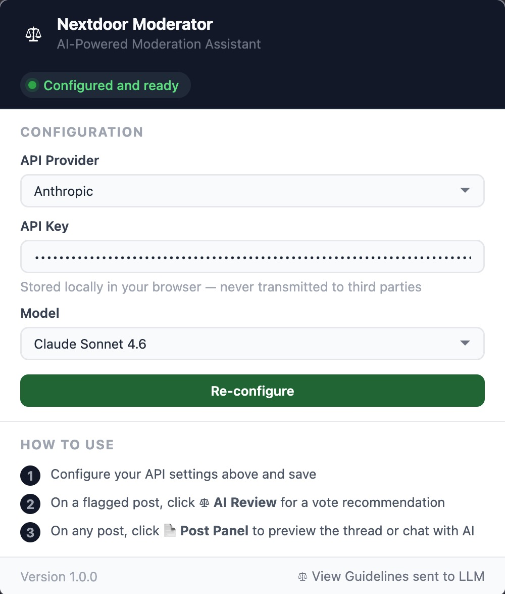
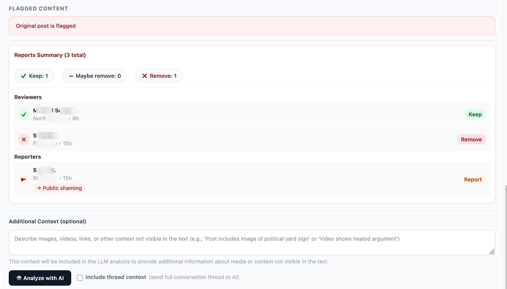
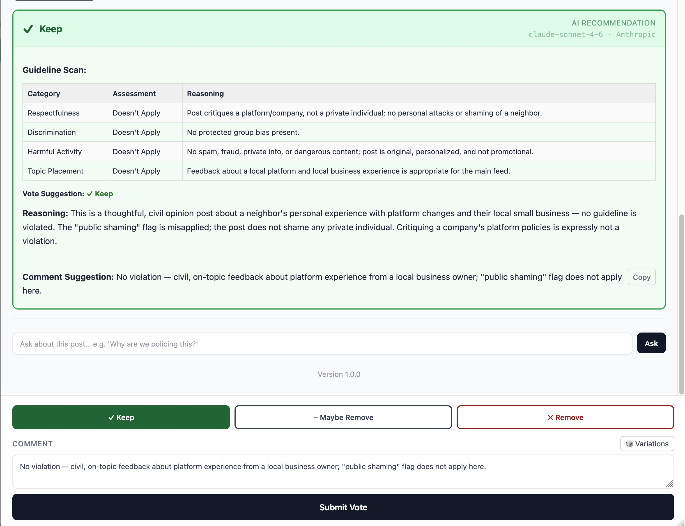
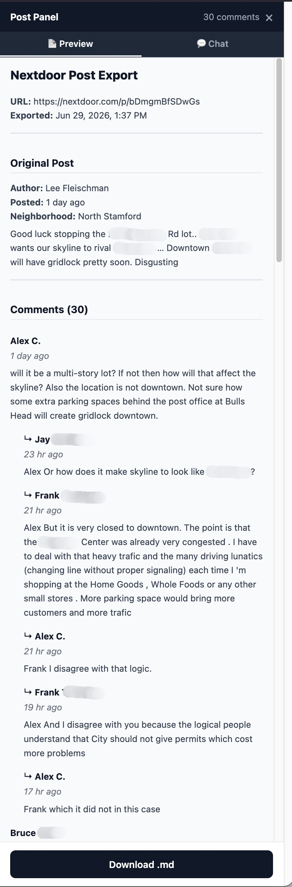
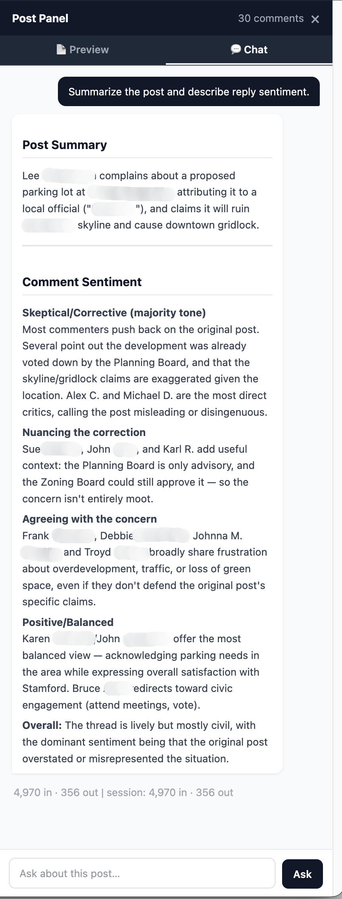

# Nextdoor Moderator Assistant (Chrome)

A Chrome extension (Manifest V3) that helps Nextdoor community moderators make faster, more consistent decisions using AI analysis.

The extension intercepts Nextdoor's moderation GraphQL API in real time, extracts post and voting data, and sends it to an LLM for independent analysis — without leaving the page.

> Ported from the Firefox (Manifest V2) version. Because Chrome MV3 has no equivalent of Firefox's `webRequest.filterResponseData()`, response capture is done with a page-context `fetch`/`XHR` hook instead. See [How It Works](#how-it-works).

---

## Features

- **AI Review** — One-click analysis of any flagged post against Nextdoor's official moderation guidelines, with a clear Keep / Maybe Remove / Remove recommendation and reasoning
- **Post Panel** — Expandable side panel on any open post: full thread preview, AI chat, and comment drafting
- **AI Chat** — Ask follow-up questions about a post in context; the full thread is always in scope
- **Poll Support** — Correctly handles survey/poll posts in addition to standard text posts
- **Widget** — Floating toolbar with quick access to AI Review, Post Panel, and Mod History
- **Per-Provider API Keys** — OpenAI and Anthropic keys stored separately; switching providers restores the correct key automatically
- **Model Attribution** — Every AI recommendation shows which model and provider generated it
- **Privacy-First** — API keys stored locally in `chrome.storage.local`, never transmitted to third parties

---

## Screenshots

**Extension Popup** — Configure your LLM provider, API key, and model. Validated before saving.



**Moderation Overlay** — Reports summary with vote counts, individual reviewer votes, and optional context input before AI analysis.



**AI Recommendation** — Color-coded verdict card with guideline scan, reasoning, and a ready-to-use comment suggestion. Model and provider shown top-right.



**Post Panel — Preview** — Full thread view with all comments and replies, exportable as markdown.



**Post Panel — AI Chat** — Ask questions about the post in context. The full thread is always included.



---

## Installation

### From the Chrome Web Store

*(Coming soon)*

### Manual / Development (Load Unpacked)

1. Clone the repo and install dependencies:
   ```bash
   git clone https://github.com/DrBenedictPorkins/nextdoor-moderator-extension.git
   cd nextdoor-moderator-extension
   npm install
   ```

2. Build:
   ```bash
   npm run build
   ```

3. Load in Chrome:
   - Navigate to `chrome://extensions`
   - Toggle **Developer mode** (top-right)
   - Click **Load unpacked**
   - Select the generated `dist/` folder

4. Configure:
   - Click the extension icon in the toolbar
   - Select your LLM provider (OpenAI or Anthropic)
   - Paste your API key and choose a model
   - Click **Save Configuration** — the key is validated before saving

> After rebuilding, click the **Reload** (↻) button on the extension card in `chrome://extensions`.

---

## Usage

### Moderation Queue

1. Go to `https://nextdoor.com/moderation_feed`
2. Click a flagged post
3. Click **⚖ AI Review** in the floating widget — the extension captures the API response automatically
4. Review the color-coded recommendation (green = Keep, red = Remove, amber = Maybe Remove)
5. The recommendation includes tag analysis, reasoning, and a suggested moderator comment

> If you're not on a moderation page, clicking ⚖ AI Review navigates you there.

### Post Panel

On any open Nextdoor post, click **📄 Post Panel** in the widget to open a side panel with:

- Full thread preview with commenter context
- **AI Chat** tab — ask questions about the post; the full thread is always included
- Mod History shortcut

### Additional Context

Before clicking "Analyze with AI", use the **Additional Context** field to describe anything the LLM can't see — images, videos, links. The LLM uses this as factual input only; moderator opinions in that field do not influence the vote.

---

## Configuration

| Setting | Description |
|---------|-------------|
| API Provider | OpenAI or Anthropic |
| API Key | Stored per-provider in `chrome.storage.local` |
| Model | Provider-specific model list; validated on save |

Keys are validated against the live API before saving. Switching providers restores the previously saved key for that provider.

### Supported Models

**OpenAI:** GPT-4o, GPT-4o mini, o3, o4-mini

**Anthropic:** Claude Sonnet 4.6, Claude Haiku 4.5

---

## How It Works

```
1. A MAIN-world content script (net-hook) patches window.fetch / XHR at document_start
2. When Nextdoor calls its ModerationFeed GraphQL API, the hook clones the
   response text and window.postMessages it to the isolated content script
3. The content script forwards the body to the background service worker
4. The service worker parses moderationSummaryV3: post content, reports, votes, thread
5. Content script enables the ⚖ AI Review button in the widget
6. User clicks AI Review → overlay opens with post metadata
7. User optionally adds context → clicks Analyze with AI
8. Service worker sends a structured prompt to the configured LLM
9. LLM response parsed and displayed inline with vote card + reasoning
```

**Why a page-context hook?** Firefox reads GraphQL response bodies with
`webRequest.filterResponseData()`. Chrome MV3 removed blocking `webRequest` and
never had `filterResponseData`, so the only reliable way to read response bodies
is to wrap `fetch`/`XHR` in the page's own JS context (`"world": "MAIN"`) and
post the data back to the extension.

---

## Permissions

| Permission | Reason |
|------------|--------|
| `storage` | Store API configuration locally |
| `host_permissions: *://*.nextdoor.com/*` | Run on Nextdoor pages and read moderation data |
| `host_permissions: *://*.anthropic.com/*` | Anthropic API calls |
| `host_permissions: *://*.openai.com/*` | OpenAI API calls |

No `activeTab`, `webRequest`, `webRequestBlocking`, or `tabs` permission is requested.

---

## Development

```bash
npm run dev      # Watch mode with auto-rebuild
npm run build    # Production build → dist/
```

After rebuilding, click **Reload** on the extension card in `chrome://extensions`.

---

## Privacy

See [PRIVACY.md](PRIVACY.md) for the full privacy policy.

---

## Disclaimer

This extension is not affiliated with or endorsed by Nextdoor. It is an independent tool to assist community moderators. All moderation decisions rest with the human moderator.

---

## License

[MIT](LICENSE)
